## MRC（机器阅读理解）开源代码解析

## Contents

[TOC]


## 一、基于大规模MRC数据再训练

此库发布的再训练模型，在 阅读理解/分类 等任务上均有大幅提高<br/>
（已有多位小伙伴在 Dureader、法研杯、医疗问答 等多个比赛中取得**top5**的好成绩😁）

|                模型/数据集                 |  Dureader-2021  |  tencentmedical |
| ------------------------------------------|--------------- | --------------- |
|                                           |    F1-score    |    Accuracy     |
|                                           |  dev / A榜     |     test-1      |
| macbert-large (哈工大预训练语言模型)         | 65.49 / 64.27  |     82.5        |
| roberta-wwm-ext-large (哈工大预训练语言模型) | 65.49 / 64.27  |     82.5        |
| macbert-large (ours)                      | 70.45 / **68.13**|   **83.4**    |
| roberta-wwm-ext-large (ours)              | 68.91 / 66.91   |    83.1        |


* **数据来源**
  * 网上收集的大量中文MRC数据
  （其中包括公开的MRC数据集以及自己爬取的网页数据等，
  囊括了医疗、教育、娱乐、百科、军事、法律、等领域。）

* **数据构造**
  * 清洗
    * 舍弃：context>1024的舍弃、question>64的舍弃、网页标签占比超过30%的舍弃。
    * 重新标注：若answer>64且不完全出现在文档中，则采用模糊匹配: 计算所有片段与answer的相似度(F1值)，取相似度最高的且高于阈值（0.8）
  * 数据标注
    * 收集的数据有一部分是不包含的位置标签的，仅仅是(问题-文章-答案)的三元组形式。
      所以，对于只有答案而没有位置标签的数据通过正则匹配进行位置标注：<br/>
      ① 若答案片段多次出现在文章中，选择上下文与问题最相似的答案片段作为标准答案（使用F1值计算相似度，答案片段的上文48和下文48个字符作为上下文）；<br/>
      ② 若答案片段只出现一次，则默认该答案为标准答案。
    * 采用滑动窗口将长文档切分为多个重叠的子文档，故一个文档可能会生成多个有答案的子文档。
  * 无答案数据构造
    * 在跨领域数据上训练可以增加数据的领域多样性，进而提高模型的泛化能力，而负样本的引入恰好能使得模型编码尽可能多的数据，加强模型对难样本的识别能力：<br/>
      ① 对于每一个问题，随机从数据中捞取context，并保留对应的title作为负样本;（50%）<br/>
      ② 对于每一个问题，将其正样本中答案出现的句子删除，以此作为负样本；（20%）<br/>
      ③ 对于每一个问题，使用BM25算法召回得分最高的前十个文档，然后根据得分采样出一个context作为负样本，
      对于非实体类答案，剔除得分最高的context（30%）
* **用途**  
  * 此mrc模型可直接用于`open domain`，[点击体验](https://huggingface.co/luhua/chinese_pretrain_mrc_roberta_wwm_ext_large)
  * 将此模型放到下游 MRC/分类 任务微调可比直接使用预训练语言模型提高`2个点`/`1个点`以上
* **合作**
  * 相关训练数据以及使用更多数据训练的模型/一起打比赛 可邮箱联系(luhua98@foxmail.com)~ 
  
```
----- 使用方法 -----
from transformers import AutoTokenizer, AutoModelForQuestionAnswering

model_name = "chinese_pretrain_mrc_roberta_wwm_ext_large" # "chinese_pretrain_mrc_macbert_large"

# Use in Transformers
tokenizer = AutoTokenizer.from_pretrained(f"luhua/{model_name}")
model = AutoModelForQuestionAnswering.from_pretrained(f"luhua/{model_name}")

# Use locally（通过 https://huggingface.co/luhua 下载模型及配置文件）
tokenizer = BertTokenizer.from_pretrained(f'./{model_name}')
model = AutoModelForQuestionAnswering.from_pretrained(f'./{model_name}')
```

## 二、仓库介绍
* **目的**
  * **开源了基于MRC数据再训练的模型**，在MRC任务下微调，效果大幅优于使用预训练的语言模型，其次，旨在提供一个效果不错的`强基线`
  * 有些[mrc比赛](#比赛)由于"年代久远"整理不过来（`others`文件夹），但方案和代码都有，对比着看就看懂了
* **优化**
  * 代码基于Hugginface的squad代码。之前自己开发，版本多且许多细节没有考虑，便转移到squad代码上迭代。但其实现的类缺乏对中文的支持，推理结果有一些影响，**修改之后 此库能较好的支持中文，抽取的答案精度也尽可能不受影响**
  

## 三、比赛

* [疫情政务问答助手 第一](https://www.datafountain.cn/competitions/424)
* [Dureader-2021语言与智能技术竞赛 第三](https://aistudio.baidu.com/aistudio/competition/detail/66?isFromLuge=true)
* [Dureader-2020语言与智能技术竞赛 第二](https://aistudio.baidu.com/aistudio/competition/detail/28?isFromCcf=true)
* [Dureader-2019语言与智能技术竞赛 第五](https://ai.baidu.com/broad/leaderboard?dataset=dureader)
* [成语阅读理解 第二](https://www.biendata.xyz/competition/idiom/)
* [莱斯杯军事阅读理解 第三](https://www.heywhale.com/home/competition/5d142d8cbb14e6002c04e14a/leaderboard)


## 四、运行流程

脚本参数解释

* `--lm`: 要加载的模型的文件夹名称
* `--do_train`: 开启训练
* `--evaluate_during_training`: 开启训练时的验证
* `--do_test`:  开启预测
* `--version_2_with_negative`: 开启适配于数据中有`无答案数据`（如：squad2.0、dureader2021）
* `--threads`: 数据处理所使用的线程数（可以通过os.cpu_count()查看机器支持的线程数）
  
##### 一、数据 & 模型：
* 将train、dev、test等数据放在datasets文件夹下(样例数据已给出，符合格式即可)
* 通过 export lm=xxx 指定模型目录

##### 二、一键运行
```python 
sh train_bert.sh  # sh test_bert.sh
```

##### 三、无答案问题
* 如果包含无答案类型数据（如：squad2.0、dureader2021），加入--version_2_with_negative就行
* 将数据替换为Dureader2021_checklist的数据, 加入--version_2_with_negative即可


## 五、小小提示：
* 代码上传前已经跑通。文件不多，所以如果碰到报错之类的信息，可能是代码路径不对、缺少安装包等问题，一步步解决，可以提issue
* 环境
  ```
  pip install transformers==2.10.0 
  ```
* 代码基于transformers 2.10.0版本，但是预训练模型可以使用其他版本加载。转换为tf可使用[转换](https://github.com/huggingface/transformers/blob/master/src/transformers/models/bert/convert_bert_pytorch_checkpoint_to_original_tf.py)
* 预训练相关参数 [参考](https://github.com/basketballandlearn/MRC_Competition_Dureader/issues/33)

## 六、模型介绍

### 6.1、模型参数配置方法

```python
import argparse
parser = argparse.ArgumentParser()
parser.add_argument("--server_ip", type=str, default="", help="Can be used for distant debugging.")
parser.add_argument("--null_score_diff_threshold",type=float,default=0.0,help="If null_score - best_non_null is greater than the threshold predict null.",)
parser.add_argument("--do_eval", default=True,action="store_true", help="Whether to run eval on the dev set.")
parser.add_argument("--threads", type=int, default=3, help="multiple threads for converting example to features")
parser.add_argument("--local_rank", type=int, default=-1, help="local_rank for distributed training on gpus")
args = parser.parse_args()
# 注意每个进程分配一个 local_rank 参数，表示当前进程在当前主机上的编号。例如：rank=2, local_rank=0 表示第 3 个节点上的第 1 个进程。
```

### 6.2、预训练模型加载

```python
    from transformers import (
    BertConfig,
    BertTokenizer,
    AutoModelForQuestionAnswering,)
    # 加载模型配置文件
    config = BertConfig.from_pretrained(
    args.config_name if args.config_name else args.model_name_or_path,
    cache_dir=args.cache_dir if args.cache_dir else None,
    )
    # 加载模型tokenizer
    tokenizer = BertTokenizer.from_pretrained(
    args.tokenizer_name if args.tokenizer_name else args.model_name_or_path,
    do_lower_case=args.do_lower_case,
    cache_dir=args.cache_dir if args.cache_dir else None,
    )
    # 加载预训练模型
    model = AutoModelForQuestionAnswering.from_pretrained(
    args.model_name_or_path,
    from_tf=bool(".ckpt" in args.model_name_or_path),
    config=config,
    cache_dir=args.cache_dir if args.cache_dir else None,
    )
    # 将模型加载到设备
    model.to(args.device)
```

```
# 模型加载结果
03/17/2022 14:38:47 - INFO - transformers.configuration_utils -   loading configuration file G:\MRC\MRC_Competition_Dureader-master\pretrain_model/config.json
03/17/2022 14:38:47 - INFO - transformers.configuration_utils -   Model config BertConfig {
  "architectures": [
    "BertForQuestionAnswering"
  ],
  "attention_probs_dropout_prob": 0.1,
  "directionality": "bidi",
  "hidden_act": "gelu",
  "hidden_dropout_prob": 0.1,
  "hidden_size": 1024,
  "initializer_range": 0.02,
  "intermediate_size": 4096,
  "layer_norm_eps": 1e-12,
  "max_position_embeddings": 512,
  "model_type": "bert",
  "num_attention_heads": 16,
  "num_hidden_layers": 24,
  "pad_token_id": 0,
  "pooler_fc_size": 768,
  "pooler_num_attention_heads": 12,
  "pooler_num_fc_layers": 3,
  "pooler_size_per_head": 128,
  "pooler_type": "first_token_transform",
  "type_vocab_size": 2,
  "vocab_size": 21128
}
03/17/2022 14:38:47 - INFO - transformers.tokenization_utils -   Model name 'G:\MRC\MRC_Competition_Dureader-master\pretrain_model/vocab.txt' not found in model shortcut name list (bert-base-uncased, bert-large-uncased, bert-base-cased, bert-large-cased, bert-base-multilingual-uncased, bert-base-multilingual-cased, bert-base-chinese, bert-base-german-cased, bert-large-uncased-whole-word-masking, bert-large-cased-whole-word-masking, bert-large-uncased-whole-word-masking-finetuned-squad, bert-large-cased-whole-word-masking-finetuned-squad, bert-base-cased-finetuned-mrpc, bert-base-german-dbmdz-cased, bert-base-german-dbmdz-uncased, bert-base-finnish-cased-v1, bert-base-finnish-uncased-v1, bert-base-dutch-cased). Assuming 'G:\MRC\MRC_Competition_Dureader-master\pretrain_model/vocab.txt' is a path, a model identifier, or url to a directory containing tokenizer files.
03/17/2022 14:38:47 - WARNING - transformers.tokenization_utils -   Calling BertTokenizer.from_pretrained() with the path to a single file or url is deprecated
03/17/2022 14:38:47 - INFO - transformers.tokenization_utils -   loading file G:\MRC\MRC_Competition_Dureader-master\pretrain_model/vocab.txt
03/17/2022 14:38:47 - INFO - transformers.modeling_utils -   loading weights file G:\MRC\MRC_Competition_Dureader-master\pretrain_model\pytorch_model.bin
```

### 6.3、数据处理过程

```python
#将输入的文本处理成
def load_and_cache_examples(args, tokenizer, set_type='train', output_examples=False):
    global examples
    # Load data features from cache or dataset file
    input_dir = args.feature_dir if args.feature_dir else "."
    cached_features_file = os.path.join(
        input_dir,
        "cached_{}_{}".format(
            set_type,
            str(args.max_seq_length),
        ),
    )
    # Init features and dataset from cache if it exists
    if os.path.exists(cached_features_file) and not args.overwrite_cache:
        logger.info("Loading features from cached file %s", cached_features_file)
        features_and_dataset = torch.load(cached_features_file)
        features, dataset, examples = (
            features_and_dataset["features"],
            features_and_dataset["dataset"],
            features_and_dataset["examples"],)
    else:
        logger.info("Creating features from dataset file at %s", input_dir)

        processor = MyProcessor()
        if set_type == 'dev':
            examples = processor.get_dev_examples(args.data_dir, filename=args.predict_file)
        elif set_type == 'train':
            examples = processor.get_train_examples(args.data_dir, filename=args.train_file)
        elif set_type == 'test':
            examples = processor.get_test_examples(args.data_dir, filename=args.test_file)

        features, dataset = squad_convert_examples_to_features_orig(
            examples=examples,
            tokenizer=tokenizer,
            max_seq_length=args.max_seq_length,
            doc_stride=args.doc_stride,
            max_query_length=args.max_query_length,
            is_training=set_type == 'train',
            return_dataset="pt",
            threads=args.threads,
        )
		# 将处理好的数据进行写入本地保存
        if args.local_rank in [-1, 0]:
            logger.info("Saving features into cached file %s", cached_features_file)
            torch.save({"features": features, "dataset": dataset, "examples": examples}, cached_features_file)
    is_evaluate= set_type == 'train'
    if args.local_rank == 0 and is_evaluate:
        # Make sure only the first process in distributed training process the dataset, and the others will use the cache
        torch.distributed.barrier()

    if output_examples:
        return dataset, examples, features
    return dataset
```

在构建训练数据的时候，set_type 为 'train'时，processor.get_train_examples(）函数会通过读取本地训练数据，会将数据处理成下面的形式。数据包括问题、答案和对应的文本等的形式。set_type 为test和dev形式过程都是一样的。

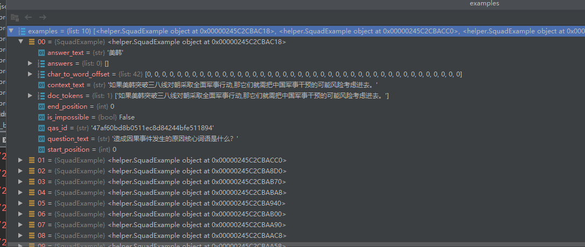

然后将得到的examples通过squad_convert_examples_to_features_orig()将示例列表转换为可直接作为模型输入的特性列表。  它依赖于模型，并利用许多标记器的特性来创建模型的输入。  作者应该是仿照datasets数据的样式，将模型训练数据处理成datasets标注形式。

### 6.4、模型训练过程

```python
def train(args, train_dataset, model, tokenizer):
    """ Train the model """
    if args.local_rank in [-1, 0]:
        tb_writer = SummaryWriter(args.summary)
	# 计算gpu训练所需batch_size
    args.train_batch_size = args.per_gpu_train_batch_size * max(1, args.n_gpu)
    train_sampler = RandomSampler(train_dataset) if args.local_rank == -1 else DistributedSampler(train_dataset)
    train_dataloader = DataLoader(train_dataset, sampler=train_sampler, batch_size=args.train_batch_size)
	# 计算模型训练所需要多少时间步
    if args.max_steps > 0:
        t_total = args.max_steps
        args.num_train_epochs = args.max_steps // (len(train_dataloader) // args.gradient_accumulation_steps) + 1
    else:
        t_total = len(train_dataloader) // args.gradient_accumulation_steps * args.num_train_epochs

    warmup_steps = int(t_total * args.warmup_ratio)
    logging_steps = int(t_total * args.logging_ratio)
    save_steps = int(t_total * args.save_ratio)

```

（1）计算模型训练一共需要多少时间步，然后分别计算warmup_steps、logging_steps和save_steps。

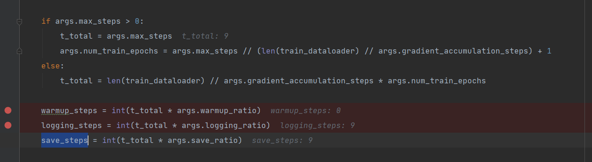

    # Prepare optimizer and schedule (linear warmup and decay)
    no_decay = ["bias", "LayerNorm.weight"]
    optimizer_grouped_parameters = [
        {
            "params": [p for n, p in model.named_parameters() if not any(nd in n for nd in no_decay)],
            "weight_decay": args.weight_decay,
        },
        {"params": [p for n, p in model.named_parameters() if any(nd in n for nd in no_decay)], "weight_decay": 0.0},
    ]
    if args.gc:
        optimizer = AdamW_GC(optimizer_grouped_parameters, lr=args.learning_rate, eps=args.adam_epsilon)
    else:
        optimizer = AdamW(optimizer_grouped_parameters, lr=args.learning_rate, eps=args.adam_epsilon)
    # optimizer = Lookahead(optimizer=optimizer, k=5, alpha=0.5)
    scheduler = get_linear_schedule_with_warmup(
        optimizer, num_warmup_steps=warmup_steps, num_training_steps=t_total
    )
    
    # Check if saved optimizer or scheduler states exist
    if os.path.isfile(os.path.join(args.model_name_or_path, "optimizer.pt")) and os.path.isfile(
        os.path.join(args.model_name_or_path, "scheduler.pt")
    ):
        # Load in optimizer and scheduler states
        optimizer.load_state_dict(torch.load(os.path.join(args.model_name_or_path, "optimizer.pt")))
        scheduler.load_state_dict(torch.load(os.path.join(args.model_name_or_path, "scheduler.pt")))
    
    # multi-gpu training (should be after apex fp16 initialization)
    if args.n_gpu > 1:
        model = torch.nn.DataParallel(model)
    # Train!
    logger.info("***** Running training *****")
    logger.info("  Num examples = %d", len(train_dataset))
    logger.info("  Num Epochs = %d", args.num_train_epochs)
    logger.info("  Instantaneous batch size per GPU = %d", args.per_gpu_train_batch_size)
    logger.info(
        "  Total train batch size (w. parallel, distributed & accumulation) = %d",
        args.train_batch_size
        * args.gradient_accumulation_steps
        * (torch.distributed.get_world_size() if args.local_rank != -1 else 1),
    )
    logger.info("  Gradient Accumulation steps = %d", args.gradient_accumulation_steps)
    logger.info("  Total optimization steps = %d", t_total)
    
    global_step = 1
    epochs_trained = 0
    steps_trained_in_current_epoch = 0
    # Check if continuing training from a checkpoint
    if os.path.exists(args.model_name_or_path):
        try:
            # set global_step to gobal_step of last saved checkpoint from model path
            checkpoint_suffix = args.model_name_or_path.split("-")[-1].split("/")[0]
            global_step = int(checkpoint_suffix)
            epochs_trained = global_step // (len(train_dataloader) // args.gradient_accumulation_steps)
            steps_trained_in_current_epoch = global_step % (len(train_dataloader) // args.gradient_accumulation_steps)
    
            logger.info("  Continuing training from checkpoint, will skip to saved global_step")
            logger.info("  Continuing training from epoch %d", epochs_trained)
            logger.info("  Continuing training from global step %d", global_step)
            logger.info("  Will skip the first %d steps in the first epoch", steps_trained_in_current_epoch)
            steps_trained_in_current_epoch *= args.gradient_accumulation_steps
        except ValueError:
            logger.info("  Starting fine-tuning.")
    
    tr_loss, logging_loss = 0.0, 0.0
    model.zero_grad()
    train_iterator = trange(
        epochs_trained, int(args.num_train_epochs), desc="Epoch", disable=args.local_rank not in [-1, 0]
    )
    # Added here for reproductibility
    set_seed(args)
    
    for _ in train_iterator:
        epoch_iterator = tqdm(train_dataloader, desc="Iteration", disable=args.local_rank not in [-1, 0])
        for step, batch in enumerate(epoch_iterator):
    
            # Skip past any already trained steps if resuming training
            if steps_trained_in_current_epoch > 0:
                steps_trained_in_current_epoch -= 1
                continue
    
            model.train()
            batch = tuple(t.to(args.device) for t in batch)
    
            inputs = {
                "input_ids": batch[0],
                "attention_mask": batch[1],
                "token_type_ids": batch[2],
                "start_positions": batch[3],
                "end_positions": batch[4],
            }

（2）加载写入本地的缓存训练数据进行，生成模型训练数据，其中模型训练数据包括input_ids,attention_mask,token_type_ids，start_positions和end_positions。

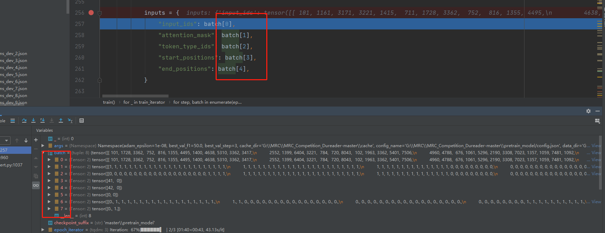

input_ids对应的tensor数据

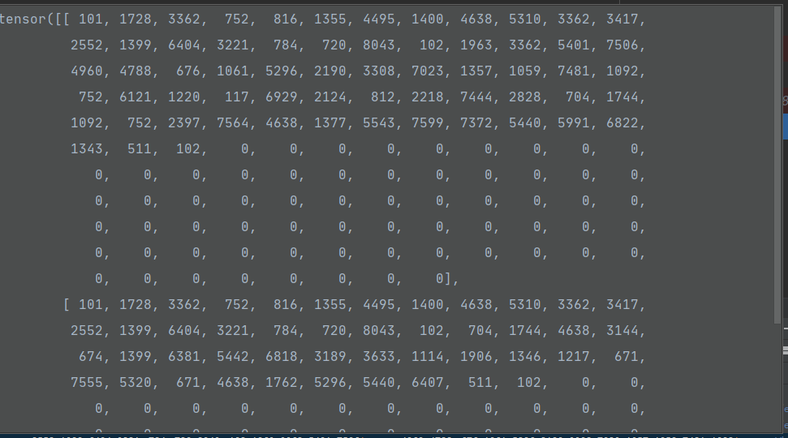

attention_mask对应的tensor数据

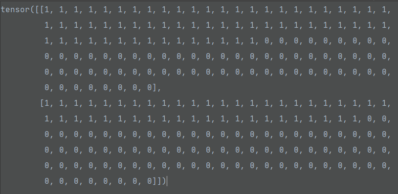

        outputs = model(**inputs)
        # model outputs are always tuple in transformers (see doc)
        loss = outputs[0]

（3）损失计算，train_loss损失使用原生的bert进行模型训练的。

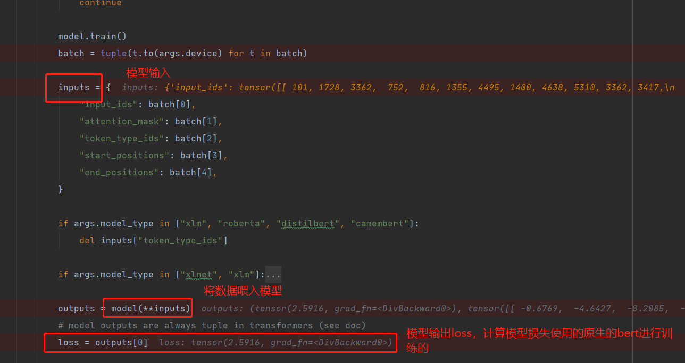

```python
#计算损失的时候，需要调用trasformers定义好问答bert_model，然后进行损失计算。
# model = AutoModelForQuestionAnswering.from_pretrained()
class BertForQuestionAnswering(BertPreTrainedModel):
    def __init__(self, config):
        super(BertForQuestionAnswering, self).__init__(config)
        self.num_labels = config.num_labels

        self.bert = BertModel(config)
        self.qa_outputs = nn.Linear(config.hidden_size, config.num_labels)

        self.init_weights()

    @add_start_docstrings_to_callable(BERT_INPUTS_DOCSTRING)
    def forward(
        self,
        input_ids=None,
        attention_mask=None,
        token_type_ids=None,
        position_ids=None,
        head_mask=None,
        inputs_embeds=None,
        start_positions=None,
        end_positions=None,
    ):

        outputs = self.bert(
            input_ids,
            attention_mask=attention_mask,
            token_type_ids=token_type_ids,
            position_ids=position_ids,
            head_mask=head_mask,
            inputs_embeds=inputs_embeds,
        )

        sequence_output = outputs[0] #outputs: last_hidden_state, pooler_output, (hidden_states), (attentions)

        logits = self.qa_outputs(sequence_output)
        start_logits, end_logits = logits.split(1, dim=-1) # 分离出的start_logits/end_logits形状为([config.hidden_size, 1])
        start_logits = start_logits.squeeze(-1) # 降维至形状为([config.hidden_size])
        end_logits = end_logits.squeeze(-1) # 降维至形状为([config.hidden_size])

        outputs = (start_logits, end_logits,) + outputs[2:]
        if start_positions is not None and end_positions is not None:
            # If we are on multi-GPU, split add a dimension
            if len(start_positions.size()) > 1:
                start_positions = start_positions.squeeze(-1)
            if len(end_positions.size()) > 1:
                end_positions = end_positions.squeeze(-1)
            # sometimes the start/end positions are outside our model inputs, we ignore these terms
            ignored_index = start_logits.size(1)
            start_positions.clamp_(0, ignored_index)
            end_positions.clamp_(0, ignored_index)

            loss_fct = CrossEntropyLoss(ignore_index=ignored_index)
            start_loss = loss_fct(start_logits, start_positions)
            end_loss = loss_fct(end_logits, end_positions)
            total_loss = (start_loss + end_loss) / 2
            outputs = (total_loss,) + outputs

        return outputs  # (loss), start_logits, end_logits, (hidden_states), (attentions)
```

### 6.5、模型解码过程

模型验证部分代码，该部分包括解

```python
def evaluate(args, model, tokenizer, prefix="dev", step=0):
    # 将模型用于验证和预测的数据进行处理
    dataset, examples, features = load_and_cache_examples(args, tokenizer, set_type=prefix, output_examples=True)
    if not os.path.exists(args.output_dir) and args.local_rank in [-1, 0]:
        os.makedirs(args.output_dir)
	# 计算模型所需要的batch_size
    args.eval_batch_size = args.per_gpu_eval_batch_size * max(1, args.n_gpu)
    # 注意DistributedSampler随机抽样
    eval_sampler = SequentialSampler(dataset)
    eval_dataloader = DataLoader(dataset, sampler=eval_sampler, batch_size=args.eval_batch_size)
    # multi-gpu evaluate
    if args.n_gpu > 1 and not isinstance(model, torch.nn.DataParallel):
        model = torch.nn.DataParallel(model)
    all_results = []
    start_time = timeit.default_timer()
    for batch in tqdm(eval_dataloader, desc="Evaluating"):
        model.eval()
        batch = tuple(t.to(args.device) for t in batch)
        with torch.no_grad():
            inputs = {
                "input_ids": batch[0],
                "attention_mask": batch[1],
                "token_type_ids": batch[2],
            }
            example_indices = batch[3]
            outputs = model(**inputs)
        for i, example_index in enumerate(example_indices):
            eval_feature = features[example_index.item()]
            unique_id = int(eval_feature.unique_id)
            output = [to_list(output[i]) for output in outputs]
            # Some models (XLNet, XLM) use 5 arguments for their predictions, while the other "simpler"
            # 获取模型输出，output分别对应不同数据
            if len(output) >= 5:
                start_logits = output[0]
                start_top_index = output[1]
                end_logits = output[2]
                end_top_index = output[3]
                cls_logits = output[4]
                result = SquadResult(
                    unique_id,
                    start_logits,
                    end_logits,
                    start_top_index=start_top_index,
                    end_top_index=end_top_index,
                    cls_logits=cls_logits,
                )

            else:
                start_logits, end_logits = output
                result = SquadResult(unique_id, start_logits, end_logits)
            all_results.append(result)
```

(1)模型预测时，如果output的长度超过5，则认为output[0]为start_logits,output[1]为start_top_index。。。

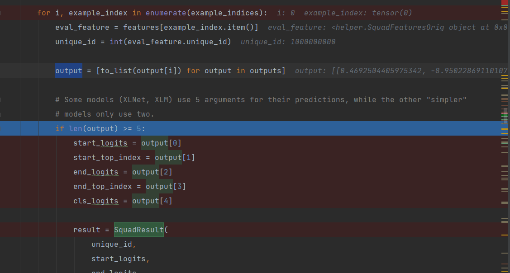

反之，output长度小于5则为，start_logits，end_logits分别为out[1],out[2]。模型预测每个字符的开始和结束logits。

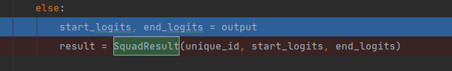

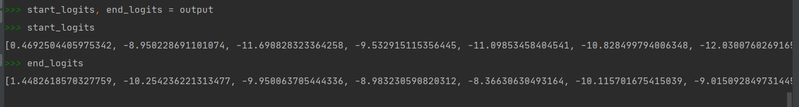

然后获得start_logits，end_logits经过SquadResult()函数，没有经过什么处理，然后返回了result，其中unique_id为问题的id。result其实就是一个问题对应的答案结果开始和结束的logits。

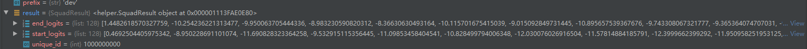

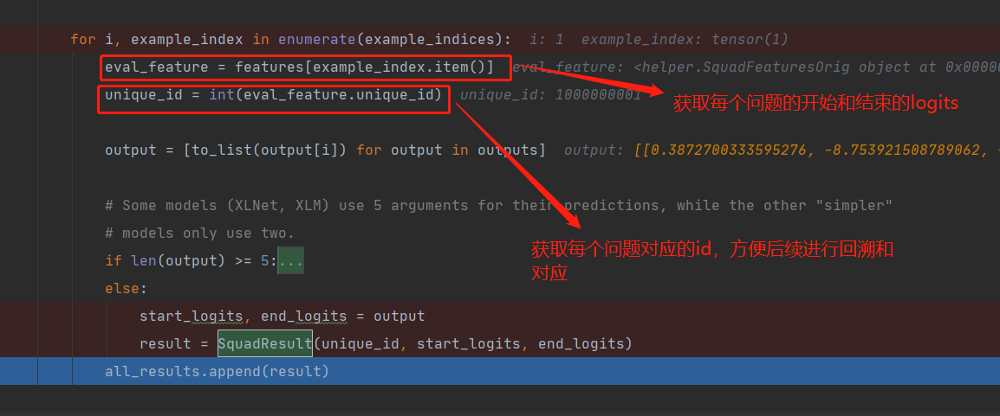

```
    evalTime = timeit.default_timer() - start_time
    logger.info("  Evaluation done in total %f secs (%f sec per example)", evalTime, evalTime / len(dataset))
    try:
        # Compute predictions
        output_prediction_file = os.path.join(args.output_dir, "predictions_{}_{}.json".format(prefix, step))
        output_nbest_file = os.path.join(args.output_dir, "nbest_predictions_{}_{}.json".format(prefix, step))
        assert isinstance(int(step),int)
    except:
        print(step)
	# 无答案解析设置
    if args.version_2_with_negative:
        output_null_log_odds_file = os.path.join(args.output_dir, "null_odds_{}_{}.json".format(prefix, step))
    else:
        output_null_log_odds_file = None

    # 模型计算预测logits函数，内含答案解码过程
    predictions = compute_predictions_logits(
        examples,
        features,
        all_results,
        args.n_best_size,
        args.max_answer_length,
        args.do_lower_case,
        output_prediction_file,
        output_nbest_file,
        output_null_log_odds_file,
        args.verbose_logging,
        args.version_2_with_negative,
        args.null_score_diff_threshold,
        tokenizer
    )

    if prefix == 'dev':
        # Compute the F1 and exact scores.
        results = squad_evaluate(examples, predictions)
        return results
    else:
        return None
```

（2）解码部分

```python
def compute_predictions_logits(
    all_examples,
    all_features,
    all_results,
    n_best_size,
    max_answer_length,
    do_lower_case,
    output_prediction_file,
    output_nbest_file,
    output_null_log_odds_file,
    verbose_logging,
    version_2_with_negative,
    null_score_diff_threshold,
    tokenizer,
):
    """Write final predictions to the json file and log-odds of null if needed."""
    logger.info("Writing predictions to: %s" % (output_prediction_file))
    logger.info("Writing nbest to: %s" % (output_nbest_file))
    example_index_to_features = collections.defaultdict(list)
    for feature in all_features:
        example_index_to_features[feature.example_index].append(feature)

    unique_id_to_result = {}
    for result in all_results:
        unique_id_to_result[result.unique_id] = result

    _PrelimPrediction = collections.namedtuple(  # pylint: disable=invalid-name
        "PrelimPrediction", ["feature_index", "start_index", "end_index", "start_logit", "end_logit"]
    )

    all_predictions = collections.OrderedDict()
    all_nbest_json = collections.OrderedDict()
    scores_diff_json = collections.OrderedDict()

    for (example_index, example) in enumerate(all_examples):
        features = example_index_to_features[example_index]
```

获取所有需要进行解码的数据，该示例问题的id为1000000000，它的其他信息如input_id，详见下图。

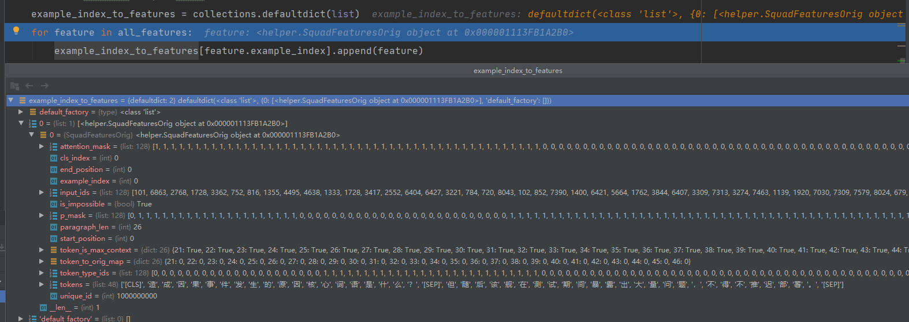

将上一步获取到的数据进行id映射

```
    unique_id_to_result = {}
    for result in all_results:
        unique_id_to_result[result.unique_id] = result
```

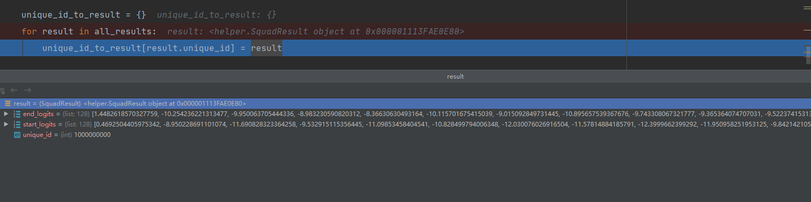

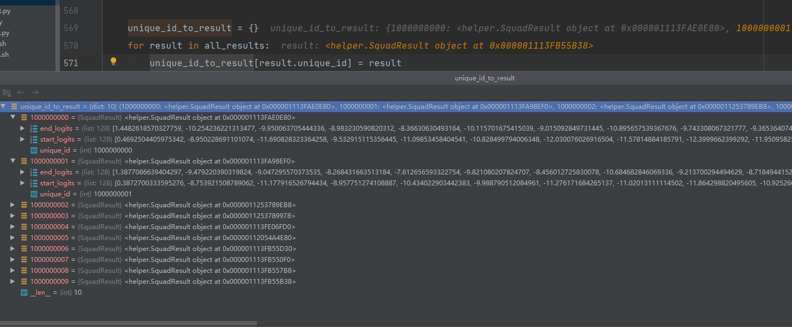

```
all_predictions = collections.OrderedDict()
    all_nbest_json = collections.OrderedDict()
    scores_diff_json = collections.OrderedDict()
    for (example_index, example) in enumerate(all_examples):
        features = example_index_to_features[example_index]
```

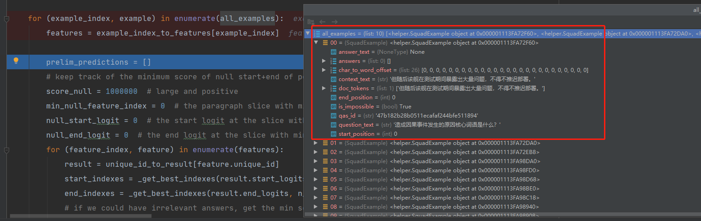

```
prelim_predictions = []
        # keep track of the minimum score of null start+end of position 0
        score_null = 1000000  # large and positive
        min_null_feature_index = 0  # the paragraph slice with min null score
        null_start_logit = 0  # the start logit at the slice with min null score
        null_end_logit = 0  # the end logit at the slice with min null score
        for (feature_index, feature) in enumerate(features):
            result = unique_id_to_result[feature.unique_id]
            start_indexes = _get_best_indexes(result.start_logits, n_best_size)
            end_indexes = _get_best_indexes(result.end_logits, n_best_size)
```

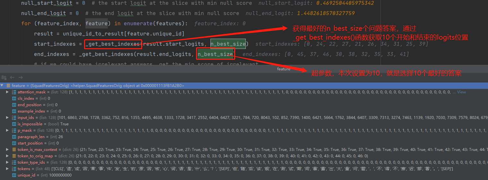

模型设置的超参数，就是需要生成对应的多少的答案。

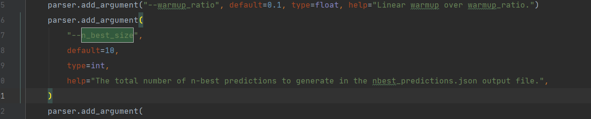

```python
 # 无答案解码最核心的一步操作，首选需要将预测答案的start_logits[0]与end_logits[0]相加获得得分，后面计算“no answer”时会用到。score_null这里应该就是【cls】对应的start_logits和end_logits
          if version_2_with_negative:
                feature_null_score = result.start_logits[0] + result.end_logits[0]
                if feature_null_score < score_null:
                    score_null = feature_null_score
                    min_null_feature_index = feature_index
                    null_start_logit = result.start_logits[0]
                    null_end_logit = result.end_logits[0]
```

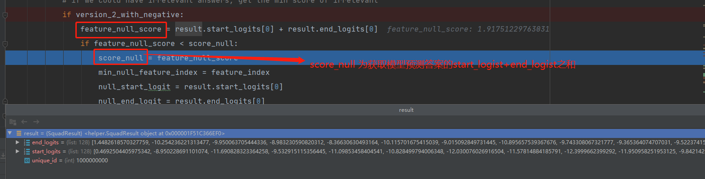

然后需要对这10个问题进行遍历判断，把所有的起始点和结束点全部遍历一遍。

```
           for start_index in start_indexes:
                for end_index in end_indexes:
                    # We could hypothetically create invalid predictions, e.g., predict
                    # that the start of the span is in the question. We throw out all
                    # invalid predictions.
                    if start_index >= len(feature.tokens):
                        continue
                    if end_index >= len(feature.tokens):
                        continue
                    if start_index not in feature.token_to_orig_map:
                        continue
                    if end_index not in feature.token_to_orig_map:
                        continue
                    if not feature.token_is_max_context.get(start_index, False):
                        continue
                    if end_index < start_index:
                        continue
                    length = end_index - start_index + 1
                    if length > max_answer_length:
                        continue
```


```
        if version_2_with_negative:
            prelim_predictions.append(
                _PrelimPrediction(
                    feature_index=min_null_feature_index,
                    start_index=0,
                    end_index=0,
                    start_logit=null_start_logit,
                    end_logit=null_end_logit,
                )
            )
        prelim_predictions = sorted(prelim_predictions, key=lambda x: (x.start_logit + x.end_logit), reverse=True)
```

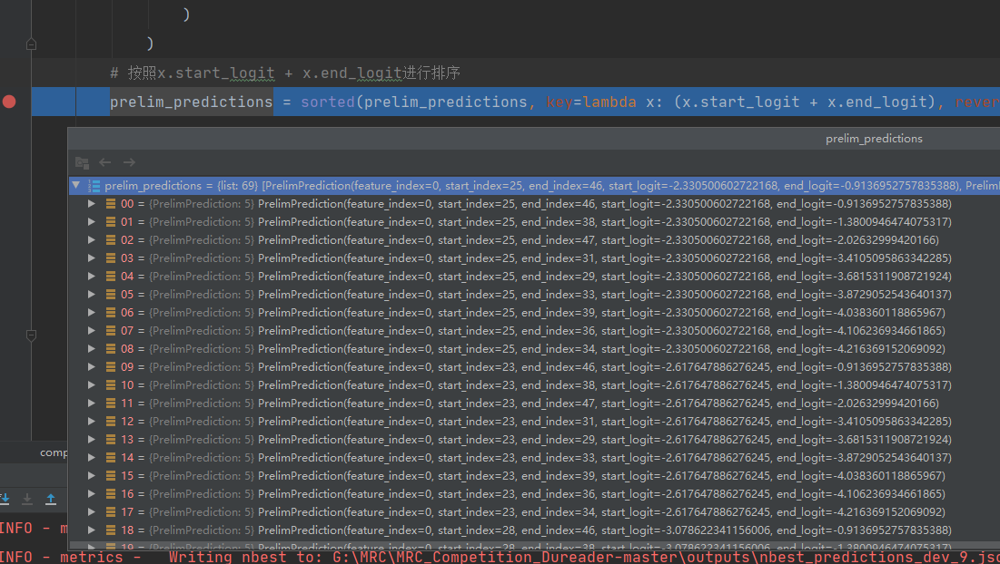

对问题的start_logits和end_logits相加后的结果进行归一化处理，生成对应的概率。

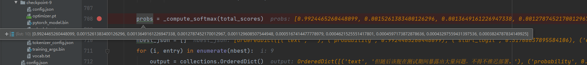


```
        # 计算无答案过程，但是这几种	情况很少在模型预测和验证的时候出现。
        if version_2_with_negative:
            if "" not in seen_predictions:
                nbest.append(_NbestPrediction(text="no answer", start_logit=null_start_logit, end_logit=null_end_logit))

            # In very rare edge cases we could only have single null prediction.
            # So we just create a nonce prediction in this case to avoid failure.
            if len(nbest) == 1:
                nbest.insert(0, _NbestPrediction(text="no answer", start_logit=0.0, end_logit=0.0))

        # In very rare edge cases we could have no valid predictions. So we
        # just create a nonce prediction in this case to avoid failure.
        if not nbest:
            nbest.append(_NbestPrediction(text="no answer", start_logit=0.0, end_logit=0.0))
```

```python
        # 计算含有答案的结果的过程
        if not version_2_with_negative:
            all_predictions[example.qas_id] = nbest_json[0]["text"]
        else:
			# 计算无答案的解码过程，需要计算score_null（【cls】对应的start_logit和end_logit之和）减去其他预测字符的start_logit和end_logit,如果结果大于零说明无答案。
            score_diff = score_null - best_non_null_entry.start_logit - (best_non_null_entry.end_logit)
            scores_diff_json[example.qas_id] = score_diff
            # null_score_diff_threshold超参设置的阈值，在此次应该为0.0
            if score_diff > null_score_diff_threshold:
                all_predictions[example.qas_id] = "no answer"
            else:
                all_predictions[example.qas_id] = best_non_null_entry.text
        all_nbest_json[example.qas_id] = nbest_json
```

## 七、感谢

[zhangxiaoyu](https://github.com/Decalogue)  [huanghui](https://github.com/huanghuidmml)  [nanfulai](https://github.com/nanfulai)


